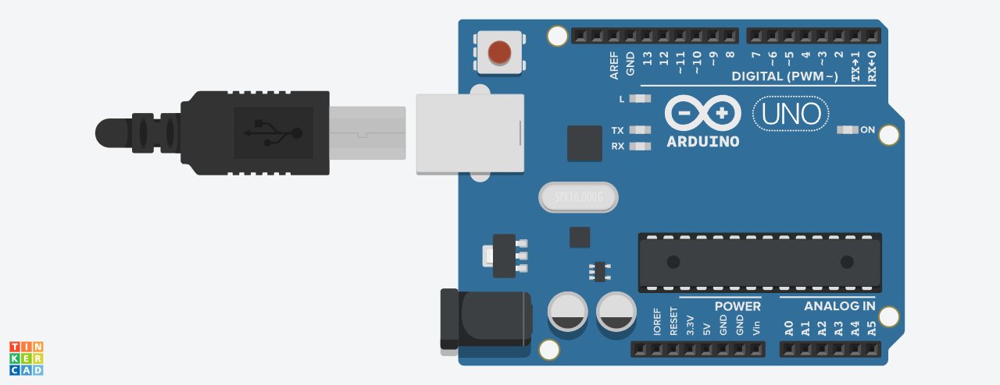

# Project 01: Built-in LED Blink

## Description
This is a fundamental "Hello, World!" project for the Arduino platform. The code makes the on-board LED (connected to pin 13) on the Arduino UNO blink continuously with a one-second interval.

## Interactive Simulation
You can view, run, and interact with a live simulation of this project on Tinkercad.

[**>> Simulate this Project on Tinkercad <<**](https://www.tinkercad.com/things/6pEjhYBJHZ2-01-built-in-led-blink)

## Circuit Diagram
This project uses the built-in LED on the Arduino board, so no external wiring is needed. The image below shows the setup in the simulator.

## How It Works
The code uses two main functions:
* `setup()`: This function runs once when the Arduino is powered on or reset. It configures the `LED_BUILTIN` pin as an `OUTPUT`.
* `loop()`: This function runs continuously after `setup()` is complete.
    1.  `digitalWrite(LED_BUILTIN, HIGH)`: Sets the voltage to the LED pin, turning the LED on.
    2.  `delay(1000)`: Pauses the program for 1000 milliseconds (1 second).
    3.  `digitalWrite(LED_BUILTIN, LOW)`: Cuts the voltage to the LED pin, turning it off.
    4.  `delay(1000)`: Pauses the program for another second.

This cycle repeats, causing the LED to blink.

## How to Use
1.  Connect your Arduino UNO to your computer via USB.
2.  Open this code in the Arduino IDE.
3.  Select the correct Board (Arduino UNO) and Port from the Tools menu.
4.  Click the "Upload" button. The on-board LED should start blinking.
