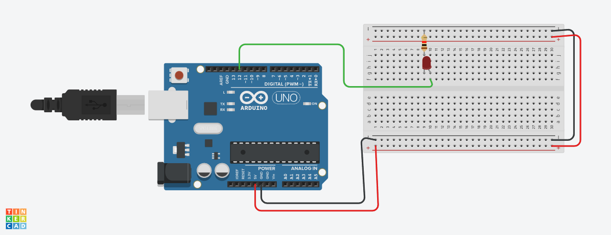

# Project 02: Interfacing a Single LED

## Description
This project demonstrates how to control a single external LED with an Arduino UNO. The code turns the LED on for one second, then off for one second, continuously. This is a fundamental step in learning how to control external components.

## Interactive Simulation
You can view and run a live simulation of this project on Tinkercad.

[**>> Simulate this Project on Tinkercad <<**](https://www.tinkercad.com/things/3b0rDEvWXsa-02-interfacing-led)

