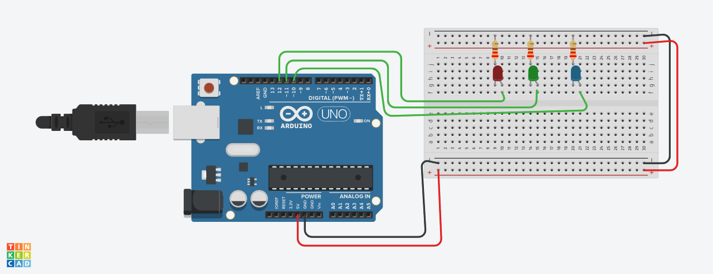

# Project 03: Controlling Multiple LEDs

## Description
This project controls three separate LEDs, turning them on and off one after another in a repeating sequence and in reverse sequence too.

## Circuit & Simulation

[**>> Simulate this Project on Tinkercad <<**](https://www.tinkercad.com/things/98XUmi9vLWt-03-multiple-leds)
